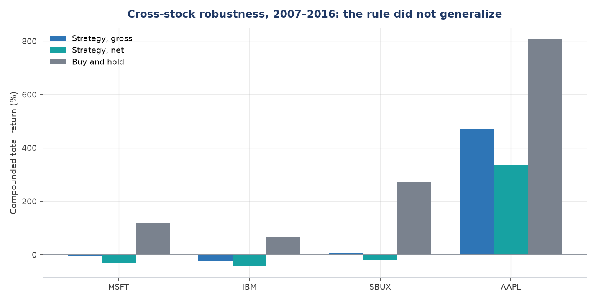
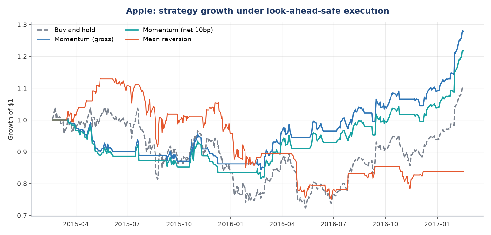
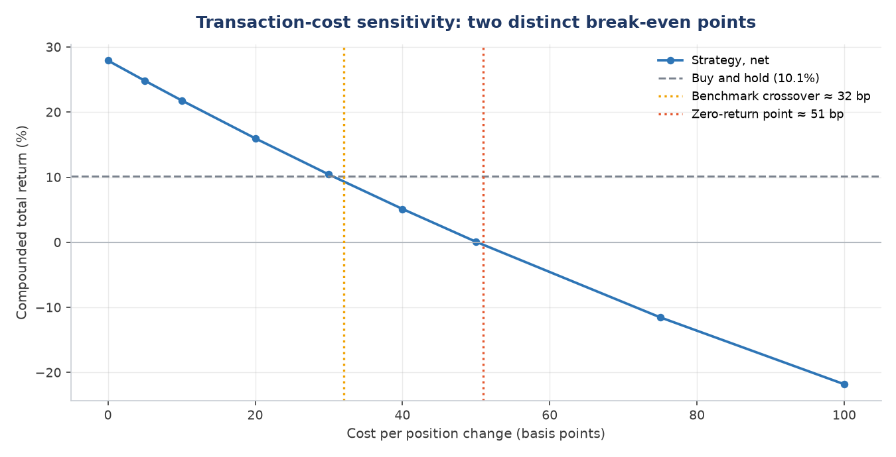
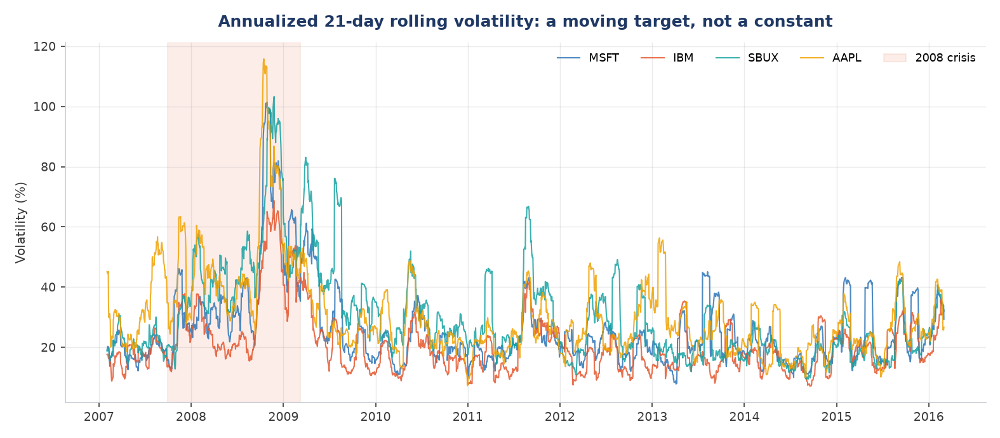
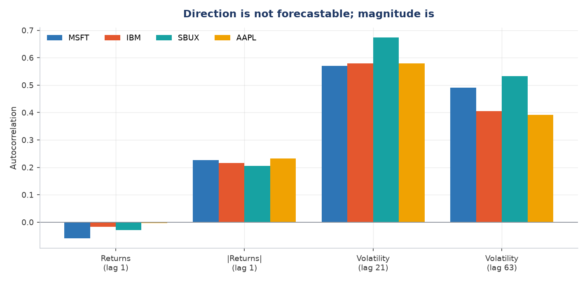
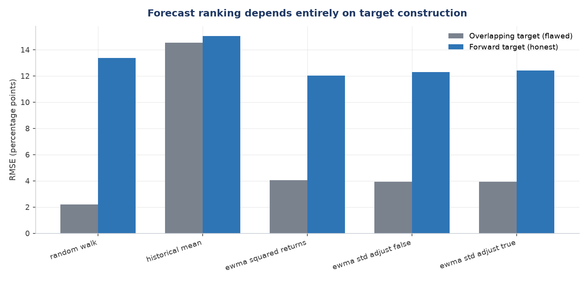
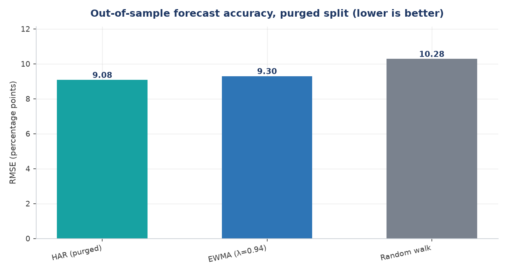
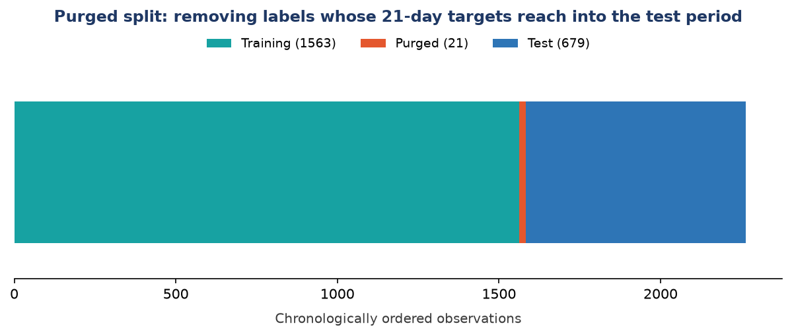

# Equity Volatility Research Pipeline

**Strategy Backtesting, Market Regime Analysis, and Forecasting with Out-of-Sample Validation in Python**

This project implements a quantitative research pipeline for US equity volatility, combining time-series analysis, econometric volatility modelling, and supervised learning under out-of-sample validation. It covers return computation from adjusted prices, backtesting of a trend-following strategy with explicit look-ahead-bias and transaction-cost controls, measurement of realized volatility and its persistence structure, and out-of-sample comparison of three volatility forecasting models. Across four equities over 2007–2016, the trend-following strategy underperformed buy-and-hold on every name tested. A Heterogeneous Autoregressive (HAR) volatility forecast, fitted on a purged training split, achieved an out-of-sample RMSE of 9.08% against 9.30% for an EWMA benchmark and 10.28% for a random walk.

## Data

| Source | Coverage | Use |
|---|---|---|
| plotly/datasets `stockdata.csv` | MSFT, IBM, SBUX, AAPL, S&P 500 index; 2007-01-03 to 2016-03-01; 2,306 rows | Strategy backtest, volatility analysis, forecasting |
| plotly/datasets `finance-charts-apple.csv` | AAPL OHLCV and adjusted close; 2015-02-17 onward; 506 rows | Initial single-asset analysis |
| `generate_synthetic()` (included) | Two simulated series, 522 business days | Illustrative example only |

All return calculations use adjusted closing prices, which correct for stock splits and dividend distributions. Using raw closing prices would record large artificial losses on ex-dividend and split dates.

**Synthetic data disclosure.** `generate_synthetic()` produces two geometric Brownian motion paths with `np.random.seed(7)`. Columns are labelled `HIGH_VOL` and `LOW_VOL` so their nature is unambiguous; they do not represent the historical prices of any listed company. All empirical results reported below use real market data only.

## Methodology

**Return and risk computation.** Daily simple returns are computed from adjusted closes. Returns are annualized arithmetically by a factor of 252 and geometrically by compounding; volatility is annualized by √252. The difference between the two annualization methods is volatility drag, approximately σ²/2.

**Strategy backtest.** A 20-day simple moving average crossover rule holds the asset when price exceeds its moving average and holds cash otherwise. Positions are lagged one day relative to signals to prevent look-ahead bias. Transaction costs of 10 basis points per position change are applied, with sensitivity tested from 0 to 100 basis points.

**Volatility estimation.** Realized volatility is measured over rolling 21-day windows and annualized. The property this exposes is conditional heteroskedasticity: variance changes over time rather than remaining constant. Its persistence, known as volatility clustering, is one of the standard stylized facts of asset returns. Persistence is assessed by autocorrelation at lags of 1, 21, and 63 trading days; only the non-overlapping lags support inference, as consecutive 21-day windows share 20 of 21 observations.

**Forecasting.** Three model families are compared: a random-walk benchmark, an expanding historical mean, and an exponentially weighted moving average with λ = 0.94 (RiskMetrics). A HAR specification regresses forward realized volatility on 1-day, 5-day, and 22-day volatility measures; constructing these horizon-specific predictors from a single return series is the feature-engineering step of the model. Coefficients are fitted by least squares on a training partition and evaluated on held-out data. NumPy and SciPy solvers return identical coefficients.

**Evaluation design.** Forecasts are scored by root mean squared error, which measures the typical size of a forecast error in the same units as the quantity being forecast, so lower is better. Errors are measured against a forward-looking, non-overlapping realized volatility target. An alternative target constructed from the next day's trailing 21-day window is reported for contrast, as it shares 20 of 21 observations with the random-walk forecast and materially distorts model ranking.

**Purged split.** Because the forecast target spans 21 forward trading days, the final 21 training observations have targets that draw on test-period returns. These observations are removed from the training partition, following a purged cross-validation protocol adapted for time-series data, yielding 1,563 training, 21 purged, and 679 test observations. Without purging the model scores 9.03%; with purging, 9.08%. The degradation confirms the leakage was real.

## Results

**Strategy backtest, four equities, 2007–2016, net of 10bp per trade:**

| | Trades | Gross | Net | Buy-and-hold |
|---|---:|---:|---:|---:|
| MSFT | 292 | −6.8% | −30.4% | +119.4% |
| IBM | 295 | −24.4% | −43.7% | +66.8% |
| SBUX | 319 | +8.0% | −21.5% | +271.7% |
| AAPL | 269 | +471.2% | +336.5% | +806.7% |

The strategy underperformed buy-and-hold on all four names and lost money outright on three. Regime decomposition shows it outperformed during the 2008 crash on two of four names, notably AAPL at +8.4% against −45.8%, but gave back substantially more during the subsequent recovery.



On the Apple 2015–2017 sample, correcting execution timing reduced the result from 193.11% to 27.93%, and applying costs reduced it further to 21.81% across 49 position changes.



**Two distinct break-even points.** The strategy stops beating cost-adjusted buy-and-hold at approximately **32 basis points** per position change. Its own compounded return reaches zero at approximately **51 basis points**. These are different thresholds and are reported separately.



**Realized volatility range, annualized:**

| | Min | Mean | Max | Max/Min |
|---|---:|---:|---:|---:|
| MSFT | 7.8% | 25.9% | 101.4% | 13.0× |
| IBM | 7.1% | 20.7% | 68.8% | 9.7× |
| SBUX | 9.4% | 30.0% | 103.3% | 11.0× |
| AAPL | 7.2% | 30.4% | 115.8% | 16.0× |

All four assets reached maximum 21-day realized volatility within a six-week window in October and November 2008. A single volatility figure computed over the full sample describes no month actually observed.



**Persistence structure:**

| | Returns, lag 1 | \|Returns\|, lag 1 | Volatility, lag 21 | Volatility, lag 63 |
|---|---:|---:|---:|---:|
| MSFT | −0.059 | 0.227 | 0.570 | 0.491 |
| IBM | −0.016 | 0.215 | 0.580 | 0.406 |
| SBUX | −0.029 | 0.205 | 0.673 | 0.533 |
| AAPL | −0.003 | 0.232 | 0.579 | 0.392 |

Returns exhibit no meaningful autocorrelation; absolute returns and volatility do. Direction is not forecastable from recent history while magnitude is. This asymmetry is the stylized fact that makes volatility, unlike return direction, a modellable quantity.



**Forecast ranking under both evaluation targets:**

| Model | Overlapping target | Forward target |
|---|---:|---:|
| Random walk | 2.21% | 13.37% |
| Historical mean | 14.54% | 15.04% |
| EWMA, squared returns | 4.04% | 12.04% |
| EWMA, weighted std, adjust=False | 3.93% | 12.30% |
| EWMA, weighted std, adjust=True | 3.92% | 12.41% |

The data, models, and code are identical across both columns. Only the evaluation target differs, and the ranking reverses completely.



**Out-of-sample forecast comparison, AAPL, purged split, test period 2013-05-21 to 2016-01-29:**

| Model | RMSE |
|---|---:|
| HAR (1, 5, 22-day) | 9.08% |
| EWMA (λ = 0.94) | 9.30% |
| Random walk | 10.28% |

HAR improves on EWMA by 2.34% and on the random walk by 11.70%. Fitted coefficients: intercept 0.1272, β_daily 0.0248, β_weekly 0.1699, β_monthly 0.4355. The regression assigns most weight to the longest horizon and near-zero weight to the single-day measure.





## Research-integrity checks

The test suite converts each methodological control into an executable assertion, so a reviewer can verify the corrections rather than take them on trust. All 15 tests pass.

| Check | Assertion |
|---|---|
| Execution timing | The position lags the signal by exactly one period |
| Look-ahead detection | The unlagged variant demonstrably overstates performance |
| Forward target | Uses only returns strictly after the forecast date |
| Target boundary | The final observations are undefined, as no future remains |
| Purge completeness | Removes exactly the horizon length; no training label reaches the test period |
| Purge scope | Shortens training only; the test set is unchanged |
| RMSE alignment | Aligns forecasts and targets by date, never by row position |
| Solver agreement | NumPy and SciPy coefficients agree to within 1e-10 |
| Reproducibility | The synthetic foundation reproduces exactly from its seed |
| Annualization | Volatility scales by √252; geometric return trails arithmetic |

**macOS and Linux**

```bash
PYTHONPATH=src python -m unittest discover -s tests -v
```

**Windows PowerShell**

```powershell
$env:PYTHONPATH="src"; python -m unittest discover -s tests -v
```

## Repository structure

```text
.
├── README.md
├── requirements.txt
├── src/equity_volatility/
│   ├── data.py          Acquisition with local snapshot fallback
│   ├── returns.py       Returns, annualization, Sharpe, drag
│   ├── strategy.py      Signals, position lagging, costs, regimes
│   ├── volatility.py    Rolling, EWMA, forward and overlapping targets
│   ├── forecast.py      HAR, purged split, RMSE
│   └── plots.py         Figure generation
├── code_layers/
│   └── research_walkthrough.py   Full analysis in development order
├── scripts/
│   ├── run_analysis.py       Full modular pipeline
│   ├── build_html_report.py  Report generation
│   └── build_docx_report.py
├── tests/test_integrity.py
├── data/                Local snapshots for deterministic reproduction
├── results/
│   ├── project_results.json
│   ├── tables/
│   └── figures/
└── report/              Full research report
```

## Two code layers

`code_layers/research_walkthrough.py` preserves the analysis as it was originally developed, in sequence, from first principles. It is the more readable entry point for understanding how the research was built.

`src/equity_volatility/` refactors the same methodology into reusable, tested modules. Both produce identical results.

## Limitations

The HAR model is fitted and tested on a single asset with one train/test split, and the test period is materially calmer than the full sample, so absolute RMSE values are not comparable across sections. Neighbouring forward-volatility targets overlap, which means forecast errors can remain serially correlated even after predictor-target leakage is removed; RMSE differences therefore carry less statistical power than the point estimates alone suggest, and no formal forecast-comparison test is reported. Transaction cost assumptions are stipulated rather than measured, and are not functions of liquidity, order size, or market impact. The crisis and recovery regime boundaries are descriptive and were selected after observing the sample, so they do not constitute an out-of-sample partition. All volatility measures are realized close-to-close rather than intraday or implied, so the implied-realized spread central to options market making lies outside this work. The strategy tested is long-only and cannot profit from declines.

These limitations bound the conclusions. The repository demonstrates research design and reproducibility, not a production trading system or a universal claim of model superiority.

## Further work

Validation depth should precede model complexity: multiple chronological splits, walk-forward evaluation with a final untouched test period, multi-asset HAR estimation, and residual diagnostics. Forecast comparison should add mean absolute error and a Diebold–Mariano test, which accounts for the serially correlated errors noted above. Model extensions include GARCH, realized semivariance, leverage effects, and comparison of realized against implied volatility when suitable options data become available.

## Reproducing

**macOS and Linux**

```bash
python3 -m venv .venv
source .venv/bin/activate
python -m pip install -r requirements.txt
PYTHONPATH=src python scripts/run_analysis.py
```

**Windows PowerShell**

```powershell
python -m venv .venv
# Only if PowerShell blocks activation; applies to this session only:
Set-ExecutionPolicy -Scope Process -ExecutionPolicy Bypass
.\.venv\Scripts\Activate.ps1
python -m pip install -r requirements.txt
$env:PYTHONPATH="src"; python scripts/run_analysis.py
```

The pipeline writes numerical results to `results/project_results.json`, tables to `results/tables/`, and figures to `results/figures/`. Data is loaded from local snapshots in `data/`; if absent, it is fetched over HTTP and cached.

## References

1. Corsi, F. (2009). "A Simple Approximate Long-Memory Model of Realized Volatility." *Journal of Financial Econometrics*, 7(2), 174–196.
2. J.P. Morgan/Reuters. (1996). *RiskMetrics — Technical Document*, Fourth Edition.
3. López de Prado, M. (2018). *Advances in Financial Machine Learning*. Wiley.
4. Diebold, F.X. and Mariano, R.S. (1995). "Comparing Predictive Accuracy." *Journal of Business & Economic Statistics*, 13(3), 253–263.

## Full report

See [`report/`](report/) for complete methodology, formulas, discussion, and limitations.
