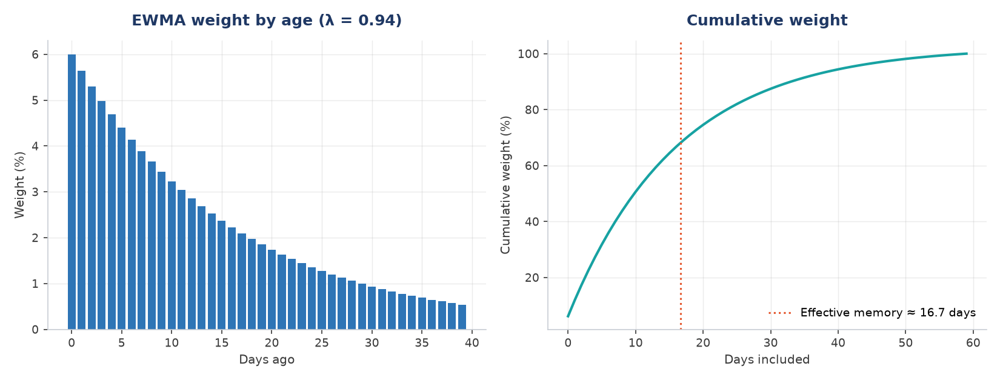

# Abstract

This report presents a time-series analysis of volatility structure and forecastability in US equities, using daily data for four large-capitalisation stocks over 2007--2016. I first test a 20-day moving-average trend-following strategy, applying explicit look-ahead-bias controls and transaction costs. The strategy underperformed buy-and-hold on all four names tested, losing money outright on three; regime decomposition shows it provided genuine downside protection during the 2008 crisis while giving back substantially more during the subsequent recovery. I then examine the persistence structure of returns and volatility. Returns show negligible autocorrelation at one-day lag, while absolute returns show approximately 0.22 and realized volatility retains 0.39--0.53 autocorrelation at a 63-day non-overlapping lag. This asymmetry --- magnitude is forecastable while direction is not --- motivates the forecasting section. I compare a random walk, an expanding historical mean, an EWMA specification with $\lambda = 0.94$, and a Heterogeneous Autoregressive (HAR) model fitted by least squares on a purged training partition under a supervised-learning protocol. On held-out data the HAR model achieves RMSE of 9.08% against 9.30% for EWMA and 10.28% for the random walk. I also document that the choice of evaluation target reverses model ranking entirely: scoring against a target constructed from overlapping windows makes the naive random walk appear superior by a wide margin.

## Contents

- [1. Data](#1-data)
  - [1.1 Sources](#1-1-sources)
  - [1.2 Price adjustment](#1-2-price-adjustment)
  - [1.3 Synthetic data disclosure](#1-3-synthetic-data-disclosure)
- [2. Methodology](#2-methodology)
  - [2.1 Return and risk computation](#2-1-return-and-risk-computation)
  - [2.2 Strategy specification and bias controls](#2-2-strategy-specification-and-bias-controls)
  - [2.3 Transaction costs](#2-3-transaction-costs)
  - [2.4 Volatility estimation](#2-4-volatility-estimation)
  - [2.5 Forecasting models](#2-5-forecasting-models)
  - [2.6 Evaluation design](#2-6-evaluation-design)
  - [2.7 Purged train/test split](#2-7-purged-train-test-split)
  - [2.8 Reproducibility and integrity verification](#2-8-reproducibility-and-integrity-verification)
- [3. Results](#3-results)
  - [3.1 Strategy performance](#3-1-strategy-performance)
  - [3.2 Regime decomposition](#3-2-regime-decomposition)
  - [3.3 Cost sensitivity](#3-3-cost-sensitivity)
  - [3.4 Persistence structure](#3-4-persistence-structure)
  - [3.5 Forecast comparison](#3-5-forecast-comparison)
- [4. Discussion](#4-discussion)
  - [4.1 Why the strategy failed](#4-1-why-the-strategy-failed)
  - [4.2 Why evaluation target determines the conclusion](#4-2-why-evaluation-target-determines-the-conclusion)
  - [4.3 Why the fitted coefficients favour longer horizons](#4-3-why-the-fitted-coefficients-favour-longer-horizons)
  - [4.4 Zero-mean versus estimated-mean variance](#4-4-zero-mean-versus-estimated-mean-variance)
  - [4.5 The forecasting stage as a supervised-learning problem](#4-5-the-forecasting-stage-as-a-supervised-learning-problem)
- [5. Limitations](#5-limitations)
- [6. Further work](#6-further-work)
- [References](#references)
- [Appendix: Reproduction](#appendix-reproduction)

# 1. Data

## 1.1 Sources

The primary dataset covers daily closing prices for Microsoft, IBM, Starbucks, and Apple, alongside the S&P 500 index, spanning 2007-01-03 to 2016-03-01. After differencing to returns this yields 2,305 observations per asset. A secondary dataset covering Apple from 2015-02-17 to 2017-02-16, comprising 506 trading days, is used for initial single-asset analysis. It provides open, high, low, close, and volume fields together with adjusted closes; only the adjusted close is used here. Both are retrieved over HTTP at runtime from the plotly public datasets repository.

## 1.2 Price adjustment

All return computations use adjusted closing prices. Adjusted closes retroactively correct historical prices for stock splits and dividend distributions. A two-for-one split halves the raw closing price overnight while leaving shareholder wealth unchanged; computing returns from raw closes would record a 50% loss on that date. Dividend payments produce a smaller version of the same distortion. Using unadjusted prices is a common source of spurious results in retail backtests.

## 1.3 Synthetic data disclosure

The function `generate_synthetic()` in `src/equity_volatility/data.py` produces two simulated price series by geometric Brownian motion (seed 7, 522 business days). Its columns are labelled `HIGH_VOL` and `LOW_VOL` so that their simulated nature is unambiguous; they do not correspond to the historical prices of any listed company. These series are used only for an introductory illustration of risk-adjusted comparison, and no empirical result in this report derives from them.

# 2. Methodology

## 2.1 Return and risk computation

Daily simple returns are computed as

$$R_t = \frac{P_t - P_{t-1}}{P_{t-1}}$$

where $P_t$ is the adjusted close on day $t$. The first observation is undefined and discarded.

Two annualization conventions are applied. The arithmetic convention scales the mean daily return linearly:

$$\mu_{\text{ann}} = \bar{R} \times 252$$

The geometric convention compounds the realized path:

$$g_{\text{ann}} = \left(\prod_{t=1}^{n}(1 + R_t)\right)^{252/n} - 1$$

Volatility annualizes by the square root of time, since variance rather than volatility is additive over independent periods:

$$\sigma_{\text{ann}} = \sigma_{\text{daily}} \times \sqrt{252}$$

The two return conventions disagree by an amount approximated by

$$g \approx \mu - \frac{\sigma^2}{2}$$

a quantity termed volatility drag. On Apple over 2015--2017 the arithmetic figure was 7.76% against a geometric figure of 4.93%; compounding the geometric rate reproduces the observed total return of 10.13% over two years, while the arithmetic rate implies 16.15%. The geometric convention is used wherever a realized outcome is reported.

Risk-adjusted performance is measured by the Sharpe ratio,

$$S = \frac{\mu_{\text{ann}} - R_f}{\sigma_{\text{ann}}}$$

with the risk-free rate $R_f$ reported both at zero and at 4%.

## 2.2 Strategy specification and bias controls

The strategy holds the asset when its closing price exceeds its 20-day simple moving average and holds cash otherwise:

$$S_t = \mathbf{1}\left[P_t > \text{SMA}_{20}(t)\right]$$

Here $\mathbf{1}[\cdot]$ denotes the indicator function, which takes the value 1 when the condition inside the brackets holds and 0 otherwise. The signal is therefore 1 on days the price closes above its moving average and 0 on all other days.

Strategy returns are computed with the signal lagged one trading day:

$$R^{\text{strat}}_t = S_{t-1} \times R_t$$

The lag is essential. The signal on day $t$ is determined by the closing price on day $t$, which is not observable until the session ends. Pairing $S_t$ with $R_t$ awards the strategy a day's return conditional on information revealed only at that day's close. In the unlagged specification the strategy returned 193.11% on Apple over 2015--2017 against 10.13% for buy-and-hold; introducing the one-day lag reduced this to 27.93%. The 165-percentage-point difference is entirely attributable to look-ahead bias.

## 2.3 Transaction costs

The position held on day $t$ is $S_{t-1}$, so a position change is identified as

$$T_t = \left|S_{t-1} - S_{t-2}\right|$$

and net returns are computed as

$$R^{\text{net}}_t = S_{t-1}R_t - c \cdot T_t$$

with $c$ the cost per trade. The baseline assumption is $c = 0.001$, ten basis points, intended to encompass commission, half the bid-ask spread, and slippage. Because the conclusion depends on an unmeasured assumption, sensitivity is reported across $c \in [0, 0.01]$.

## 2.4 Volatility estimation

Realized volatility is estimated over rolling windows of $n$ trading days:

$$\hat{\sigma}^{(n)}_t = \sqrt{\frac{1}{n-1}\sum_{i=0}^{n-1}\left(R_{t-i} - \bar{R}_t\right)^2} \times \sqrt{252}$$

The sample convention with $n-1$ in the denominator is used throughout, as each window is a sample rather than a population.

The time-varying behaviour this measure exposes is conditional heteroskedasticity: the conditional variance of returns changes over time rather than remaining constant. Its persistence, commonly called volatility clustering, is one of the standard stylized facts of asset returns and is the property the forecasting models in Section 2.5 exploit.

For the forecasting models, variance is estimated under the assumption that the mean daily return is zero, so that $R_t^2$ serves as a single-observation variance estimate. This approximation is justified empirically: for Apple over the sample, the squared mean daily return is smaller than the daily variance by a factor of approximately 324. The assumption would not hold at monthly or annual frequency.

## 2.5 Forecasting models

**Random walk.** The forecast equals the current estimate, $\hat{\sigma}_{t+1} = \hat{\sigma}_t$. This is included as a benchmark; given the high measured persistence of volatility, any proposed model must improve on it to justify its complexity.

**Historical mean.** The forecast equals the expanding mean of all prior estimates. This model ignores current conditions entirely and serves as a lower bound on informativeness.

**EWMA.** Variance is updated recursively,

$$\hat{\sigma}^2_{t+1} = \lambda\hat{\sigma}^2_t + (1-\lambda)R_t^2$$

with $\lambda = 0.94$ following the RiskMetrics convention for daily data. The implied weight on an observation $k$ days prior is $(1-\lambda)\lambda^k$, giving an effective memory of $1/(1-\lambda) \approx 16.7$ days. The most recent ten observations carry approximately 46% of total weight and the most recent thirty carry 84%.

Three EWMA variants are compared: one computing the weighted mean of squared returns under the zero-mean assumption, and two computing an exponentially weighted standard deviation with and without initialisation bias adjustment.

**HAR.** The Heterogeneous Autoregressive specification regresses forward volatility on volatility measured at three horizons:

$$\hat{\sigma}_{t+1} = \beta_0 + \beta_d \hat{\sigma}^{(1)}_t + \beta_w \hat{\sigma}^{(5)}_t + \beta_m \hat{\sigma}^{(22)}_t$$

The motivation is that market participants operating at different horizons --- intraday, weekly, and monthly --- contribute distinct components to observed volatility. Constructing these three horizon-specific measures from a single return series is the feature-engineering step of the model: the raw series is transformed into predictors carrying information at different time scales. Coefficients are estimated by ordinary least squares, minimising $\sum_i (y_i - \hat{y}_i)^2$. Solutions were computed with both `numpy.linalg.lstsq` and `scipy.linalg.lstsq` and verified identical to within $10^{-10}$ relative tolerance.

## 2.6 Evaluation design

Forecasts are scored by root mean squared error, which measures the typical size of a forecast error in the same units as the quantity forecast,

$$\text{RMSE} = \sqrt{\frac{1}{n}\sum_{i=1}^{n}\left(\hat{y}_i - y_i\right)^2}$$

Two evaluation targets are constructed. **Target A** is the next day's trailing 21-day realized volatility. **Target B** is realized volatility over the 21 trading days following each date, constructed by reversing the return series, applying a trailing window, and reversing again.

Target A is unsuitable for model comparison. The trailing 21-day window on day $t+1$ shares 20 of its 21 observations with the window on day $t$, so a random-walk forecast is scored largely against itself. Target B shares no observations with any forecast constructed from information available at time $t$. All headline results use Target B; Target A results are reported in Section 3.4 to quantify the distortion.

## 2.7 Purged train/test split

The HAR model is fitted on the first 70% of observations by date and evaluated on the remaining 30%, following a purged cross-validation protocol adapted for time-series data, in which a boundary region is discarded to prevent information from the evaluation period entering model fitting. Because the target spans 21 forward trading days, the final 21 training observations have targets constructed from returns falling inside the test period. These observations are removed from the training partition:

- Training: 1,563 observations, ending 2013-04-19
- Purged boundary: 21 observations, discarded
- Test: 679 observations, 2013-05-21 to 2016-01-29

Without purging the model attains an out-of-sample RMSE of 9.03%; with purging, 9.08%. The degradation confirms the presence of mild target leakage in the unpurged specification and the corrected figure is reported throughout.

## 2.8 Reproducibility and integrity verification

Each methodological control described above is expressed as an executable assertion in an accompanying test suite, so that a reviewer can verify the corrections rather than accept them on the basis of description. Fifteen tests cover: the one-period lag between signal and position; demonstration that the unlagged variant overstates performance; that the forward target draws only on returns strictly after the forecast date and is undefined at the series tail; that the purge removes exactly the horizon length, leaves no training label reaching the test period, and shortens training only; that RMSE aligns inputs by date rather than row position; that NumPy and SciPy least-squares solutions agree to within 1e-10; that the synthetic foundation reproduces exactly from its seed; and that volatility annualizes by the square root of time with geometric return trailing arithmetic under positive volatility.

All numerical results reported in Section 3 are regenerated by a single pipeline script and written to a machine-readable results file, so figures quoted in the text and figures produced by the code cannot diverge.

# 3. Results

## 3.1 Strategy performance

Across four equities over 2007--2016, net of ten basis points per trade:

| | Trades | Gross | Net | Buy-and-hold |
|---|---:|---:|---:|---:|
| MSFT | 292 | -6.8% | -30.4% | +119.4% |
| IBM | 295 | -24.4% | -43.7% | +66.8% |
| SBUX | 319 | +8.0% | -21.5% | +271.7% |
| AAPL | 269 | +471.2% | +336.5% | +806.7% |

The strategy underperformed buy-and-hold on every name and produced negative absolute returns on three of four. Turnover averaged approximately 32 trades per year, and transaction costs consumed 23 to 135 percentage points depending on the asset.

## 3.2 Regime decomposition

Partitioning the sample at the 2009 market trough:

**Crisis, 2007-10-01 to 2009-03-09:**

| | Strategy | Buy-and-hold |
|---|---:|---:|
| MSFT | -49.2% | -47.1% |
| IBM | -32.0% | -27.2% |
| SBUX | -46.3% | -68.4% |
| AAPL | +8.4% | -45.8% |

**Recovery, 2009-03-10 to 2016-03-01:**

| | Strategy | Buy-and-hold |
|---|---:|---:|
| MSFT | +41.6% | +316.3% |
| IBM | -20.1% | +87.4% |
| SBUX | +72.8% | +1484.6% |
| AAPL | +179.1% | +814.3% |

The strategy behaved as trend-following theory predicts. It moved to cash as prices broke below their moving averages during the crisis, outperforming on two of four names and dramatically so on Apple. It then underperformed severely during the recovery, because sharp rebounds typically begin while price remains below its trailing average, leaving the strategy in cash for the initial and largest leg of each recovery.

## 3.3 Cost sensitivity

For the Apple 2015--2017 sample, net strategy return as a function of assumed cost per trade:

| Cost | 0bp | 10bp | 20bp | 30bp | 50bp | 100bp |
|---|---:|---:|---:|---:|---:|---:|
| Net return | 27.9% | 21.8% | 16.0% | 10.4% | 0.1% | -21.8% |

Buy-and-hold returned 10.1% over the same period.

Two break-even points must be distinguished, because they answer different questions. The **benchmark crossover** is the cost at which the strategy stops beating cost-adjusted buy-and-hold; on a one-basis-point grid this occurs at approximately **32 basis points**. The **zero-return point** is the cost at which the strategy's own compounded return reaches zero, which occurs at approximately **51 basis points**. A strategy can therefore be unprofitable relative to its benchmark while still returning positive absolute performance.

The appropriate conclusion is conditional: the strategy is viable only under execution costs below roughly 32 basis points, and its edge is a function of execution quality as much as of signal quality.

## 3.4 Persistence structure

| | Returns, lag 1 | \|Returns\|, lag 1 | Vol, lag 1 | Vol, lag 21 | Vol, lag 63 |
|---|---:|---:|---:|---:|---:|
| MSFT | -0.059 | 0.227 | 0.985 | 0.570 | 0.491 |
| IBM | -0.016 | 0.215 | 0.986 | 0.580 | 0.406 |
| SBUX | -0.029 | 0.205 | 0.990 | 0.673 | 0.533 |
| AAPL | -0.003 | 0.232 | 0.988 | 0.579 | 0.392 |

Return autocorrelation is negligible across all four assets. Absolute return autocorrelation is consistently near 0.22. Volatility autocorrelation at lag 1 exceeds 0.98, but this figure is inflated by window overlap and should not be interpreted as evidence of persistence. At lag 21 and lag 63, where windows are non-overlapping, autocorrelation remains between 0.39 and 0.67.

Realized volatility ranges observed over the sample:

| | Min | Mean | Max | Ratio |
|---|---:|---:|---:|---:|
| MSFT | 7.8% | 25.9% | 101.4% | 13.0$\times$ |
| IBM | 7.1% | 20.7% | 68.8% | 9.7$\times$ |
| SBUX | 9.4% | 30.0% | 103.3% | 11.0$\times$ |
| AAPL | 7.2% | 30.4% | 115.8% | 16.0$\times$ |

All four assets reached maximum 21-day realized volatility within a six-week window in October and November 2008. A single volatility figure computed over the full sample describes no month actually observed.

## 3.5 Forecast comparison

Full-sample RMSE under both evaluation targets:

| Model | Target A (overlapping) | Target B (forward) |
|---|---:|---:|
| Random walk | 2.21% | 13.37% |
| Historical mean | 14.54% | 15.04% |
| EWMA, squared returns | 4.04% | 12.04% |
| EWMA, weighted std, adjust=False | 3.93% | 12.30% |
| EWMA, weighted std, adjust=True | 3.92% | 12.41% |

Under Target A the random walk appears superior by a factor of 1.8 over the best EWMA specification. Under Target B the ranking reverses and EWMA outperforms by 9.9%. The data, models, and code are identical; only the evaluation target differs.

Out-of-sample results on the purged split, Apple, test period 2013-05-21 to 2016-01-29:

| Model | RMSE |
|---|---:|
| HAR (1, 5, 22-day) | 9.08% |
| EWMA ($\lambda = 0.94$) | 9.30% |
| Random walk | 10.28% |

HAR improves on EWMA by 2.34% and on the random walk by 11.70%. Fitted coefficients:

| Coefficient | Value |
|---|---:|
| Intercept | 0.1272 |
| $\beta_d$ (1-day) | 0.0248 |
| $\beta_w$ (5-day) | 0.1699 |
| $\beta_m$ (22-day) | 0.4355 |

# 4. Discussion

## 4.1 Why the strategy failed

The regime decomposition establishes that the strategy is not noise. It systematically exchanges upside participation for downside protection, which is the intended behaviour of a trend-following rule. Over 2007--2016 that exchange was unfavourable, because the sample is dominated by a sustained recovery in which the strategy repeatedly exited on drawdowns and re-entered after rebounds had begun. This whipsaw effect is amplified by the empirical tendency of the largest single-day gains to cluster immediately after the largest losses, precisely when a trailing-average rule is in cash.

The result should be read narrowly. It does not establish that momentum strategies are unprofitable; it establishes that this specification --- long-only, single-asset, 20-day window, ten basis points of cost --- was unprofitable on these four names over this period.

## 4.2 Why evaluation target determines the conclusion

Section 3.5 documents a complete reversal of model ranking arising solely from target construction. The mechanism is that Target A's answer for day $t+1$ is computed from a window overlapping the day-$t$ forecast in 20 of 21 observations, so the random walk is graded substantially against itself rather than against genuinely unseen data.

This is structurally identical to the look-ahead bias documented in Section 2.2 and to the window-overlap caveat in Section 3.4. All three are failures of measurement design rather than of implementation, and all three produce results that appear stronger than reality. The practical implication is that a surprising result should prompt examination of the measurement procedure before acceptance of the finding.

## 4.3 Why the fitted coefficients favour longer horizons

The HAR regression assigns 0.4355 to the 22-day term and 0.0248 to the 1-day term, a ratio of approximately 18 to 1. This is contrary to the intuition that the most recent observation should be most informative.

The explanation is measurement error. The 1-day term is constructed from a single squared return and is therefore an extremely noisy variance estimate; the 22-day term averages 22 observations and has substantially lower variance. Least squares allocates weight in proportion to signal quality, and it therefore discounts the noisiest input heavily. This provides an independent argument for multi-horizon specifications over single-parameter decay schemes: the data can determine the relative informativeness of each horizon rather than having it imposed.

## 4.4 Zero-mean versus estimated-mean variance

Among EWMA variants, the specification assuming zero mean return outperformed both specifications estimating the mean (12.04% against 12.30% and 12.41%). This is consistent with a bias-variance argument. The true daily mean return is small relative to daily variance --- smaller by a factor of approximately 324 in this sample --- so assuming it to be zero introduces negligible bias. Estimating it, by contrast, introduces estimation noise that propagates into every observation. Where the true parameter is close to zero and its estimator is noisy, imposing the restriction dominates estimating it.

## 4.5 The forecasting stage as a supervised-learning problem

The HAR stage is a supervised-learning problem on time-series data. The three horizon-specific volatility measures are features, forward realized volatility is the target, the first partition is the training set and the final partition the held-out test set, least squares is the estimator, and RMSE is the evaluation metric.

The data imposes two constraints that a conventional setup would violate. Observations are ordered, so they cannot be shuffled into random folds; k-fold cross-validation assumes independence and would place future data in the training set, invalidating the evaluation. Targets span forward windows, so the partition boundary leaks unless purged. The chronological split and the 21-observation purge follow from these two facts.

The same constraints apply to any predictive model fitted to financial time series, regardless of its complexity. They are properties of the data rather than of the estimator.

# 5. Limitations

The HAR results derive from a single asset, a single train/test split, and one test period that is materially calmer than the full sample; absolute RMSE figures are therefore not comparable across sections. Multiple splits and cross-asset replication would be required before treating the improvement over EWMA as robust.

Transaction cost assumptions are stipulated rather than measured. Ten basis points is a plausible retail figure but is not calibrated to observed spreads, and institutional execution would be materially cheaper.

All volatility measures are realized, computed from historical returns. No options data is used, so implied volatility and the implied-realized spread --- the primary economic content of options market making --- are outside the scope of this work.

The strategy tested is long-only and cannot profit from declines; results would differ for a specification permitting short positions.

Two further limitations concern inference rather than implementation. First, the crisis and recovery regime boundaries in Section 3.2 are descriptive and were selected after observing the sample. They are a useful diagnostic of strategy behaviour but do not constitute an out-of-sample partition, and the apparent crisis protection should not be read as a predictive claim.

Second, and more consequentially for the forecasting result, neighbouring forward-volatility targets overlap. The target on date $t$ and the target on date $t+1$ share twenty of their twenty-one constituent returns. Purging removed leakage between predictors and targets, but it does not address dependence among the targets themselves. Forecast errors can therefore remain serially correlated, which means the effective number of independent observations in the test set is materially smaller than its 679 rows suggest. The 2.34% RMSE improvement of HAR over EWMA is a point estimate carrying less statistical power than that figure alone implies, and no formal test of forecast-accuracy difference is reported.

# 6. Further work

Three extensions follow directly. First, replicating the HAR comparison across all four assets and multiple rolling train/test splits would establish whether the improvement over EWMA is stable or specific to this partition. Second, incorporating options-implied volatility would permit measurement of the implied-realized spread and of whether implied volatility subsumes the information in the HAR specification. Third, comparing HAR against a GARCH(1,1) specification would situate the result against the standard parametric alternative.

A fourth extension follows directly from the overlap limitation above. Forecast comparison should be supplemented with mean absolute error and with a Diebold-Mariano test, which is designed for exactly this situation: it tests equality of predictive accuracy while accounting for serially correlated forecast errors. Reporting a DM statistic alongside RMSE would convert the present point estimate into a statement with a stated confidence level.

# References

1. Corsi, F. (2009). "A Simple Approximate Long-Memory Model of Realized Volatility." *Journal of Financial Econometrics*, 7(2), 174-196.
2. J.P. Morgan/Reuters. (1996). *RiskMetrics - Technical Document*, Fourth Edition.
3. Lopez de Prado, M. (2018). *Advances in Financial Machine Learning*. Wiley. Purged cross-validation.
4. Diebold, F.X. and Mariano, R.S. (1995). "Comparing Predictive Accuracy." *Journal of Business & Economic Statistics*, 13(3), 253-263.

# Appendix: Reproduction

Dependencies: `pandas`, `numpy`, `scipy`, `requests`, `matplotlib`. Data is retrieved over HTTP at runtime. Least-squares solutions were verified across both NumPy and SciPy implementations with maximum coefficient difference of zero in the execution environment.
